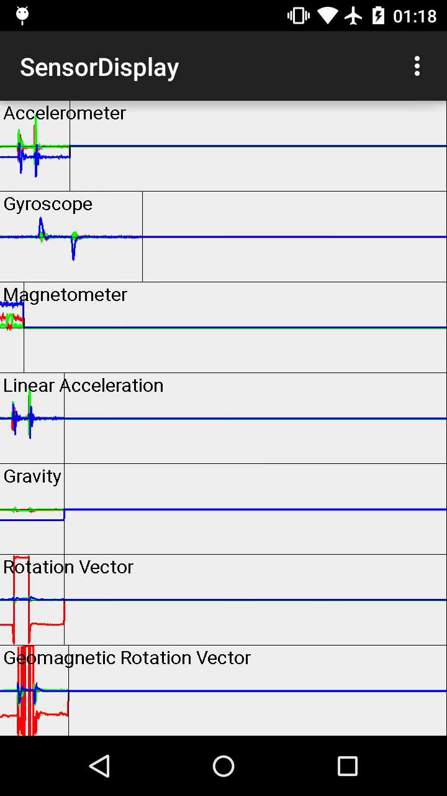

# android-sensor-display

This is a visualization of smartphone sensors where each axis is denoted with different color (e.g. X, Y, Z acceleration as red, green and blue respectively).

# License 
This project is licensed under the MIT license. See the [LICENSE](LICENSE) for details.
